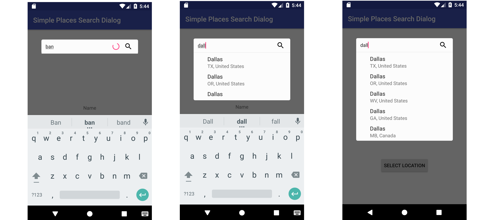

Simple Places Search Dialog
==========

A minimal and simple Google places autocomplete search dialog.

 

## Setup

Make sure you add your Google API Key in your AndroidManifest.xml
```xml
<meta-data android:name="com.google.android.geo.API_KEY"
            android:value="YOUR_API_KEY" />
```

Add this repository to you app's build.gradle file

```groovy
dependencies {
    implementation 'com.taskail:simple-places-search-dialog:1.0'
}
```

Make sure you also have Google play services

```groovy
dependencies {
    implementation 'com.google.android.gms:play-services-places:11.8.0'
}
```

## Usage

Simple Usage
```java
 SimplePlacesSearchDialog searchDialog = new SimplePlacesSearchDialogBuilder(this)
                 .setLocationListener(new SimplePlacesSearchDialog.PlaceSelectedCallback() {
             @Override
             public void onPlaceSelected(@NotNull Place place) {

                    textView.setText(place.getName())

                    latitude = place.getLatLng().latitude

             }
         }).build();

         searchDialog.show();
```

Available Place Information (vary depending on whether it's a city or establishment)

```java

                place.getName();
                place.getAddress();
                place.getAttributions();
                place.getId();
                place.getLatLng();
                place.getLocale();
                place.getPlaceTypes();
                place.getWebsiteUri();
                place.getPhoneNumber();
                place.getViewport();
                place.getRating();
                place.getPriceLevel();

```

Customization

```java

 LatLngBounds MT_VIEW_CALIFORNIA = new LatLngBounds(LatLng(37.398160, -122.180831), LatLng(37.430610, -121.972090));

 SimplePlacesSearchDialog searchDialog = new SimplePlacesSearchDialogBuilder(this)

                  //Filter for cities only
                 .setResultsFilter(AutocompleteFilter.TYPE_FILTER_CITIES)

                  // enter a custom hint
                 .setSearchHint("search hint")

                  // enter bounds, Mountain View California in this case
                  //Default = the world
                 .setLatLngBounds(MT_VIEW_CALIFORNIA)

                 .setLocationListener(new SimplePlacesSearchDialog.PlaceSelectedCallback() {
             @Override
             public void onPlaceSelected(@NotNull Place place) {

                    textView.setText(place.getName())

                    latitude = place.getLatLng().latitude

             }
         }).build();

         searchDialog.show();
```

Available Filters

```java
AutocompleteFilter.TYPE_FILTER_CITIES // searchHint = Enter City
AutocompleteFilter.TYPE_FILTER_ESTABLISHMENT // searchHint = Enter Business
AutocompleteFilter.TYPE_FILTER_ADDRESS // searchHint = Enter Address
AutocompleteFilter.TYPE_FILTER_REGIONS // searchHint = Enter Location

//default
NONE // searchHint = Enter Location

```